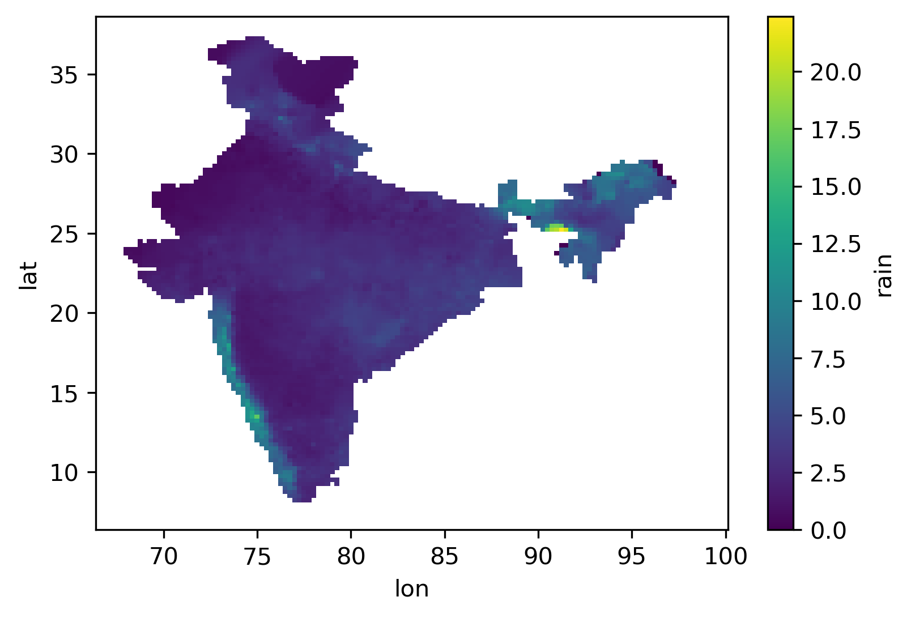

Downloading
===========

IMDLIB is capable of downloading gridded rainfall and temperature (minimum and maximum) data. Here is an example of downloading rainfall data from 2010 to 2018:

.. code-block:: python

    import imdlib as imd

    start_yr = 2010
    end_yr = 2018
    variable = 'rain' # other options are ('tmin'/ 'tmax')
    data = imd.get_data(variable, start_yr, end_yr, fn_format='yearwise')

Output
------

.. code-block:: text

    Downloading: rain for year 2010
    Downloading: rain for year 2011
    Downloading: rain for year 2012
    Downloading: rain for year 2013
    Downloading: rain for year 2014
    Downloading: rain for year 2015
    Downloading: rain for year 2016
    Downloading: rain for year 2017
    Downloading: rain for year 2018
    Download Successful !!!

The output is saved in the current working directory. If you want to save the files to a different directory, then you can use the following code:

.. code-block:: python

    import imdlib as imd

    start_yr = 2010
    end_yr = 2018
    variable = 'rain' # other options are ('tmin'/ 'tmax')
    file_dir = (r'C:\Users\imdlib\Desktop\\') #Path to save the files
    imd.get_data(variable, start_yr, end_yr, fn_format='yearwise', file_dir=file_dir)

Reading IMD datasets
====================

One of the major purposes of IMDLIB is to process IMD’s gridded datasets. The original data is available in ``grd`` file format. IMDLIB can read ``grd`` file in ``xarray`` and will create an ``IMD class object``.

.. code-block:: python

    import imdlib as imd

    start_yr = 2010
    end_yr = 2018
    variable = 'rain' # other options are ('tmin'/ 'tmax')
    file_dir = (r'C:\Users\imdlib\Desktop\\') #Path to save the files
    data = imd.open_data(variable, start_yr, end_yr,'yearwise', file_dir)
    data

.. [*] This step is for reading IMD datasets after they are downloaded. If you have the data already downloaded and stored locally, you can directly use this step to read the datasets.

Output
------

``<imdlib.core.IMD at 0x13e5b3753c8>``

- ``file_dir`` should refer to top-level directory. It should contain 3 sub-directories ``rain``, ``tmin``, and ``tmax``.

- If ``file_dir`` exists without any subdirectory, IMDLIB will look for the files in ``file_dir``. But be careful if you are using ``file_format = ‘yearwise’``, as it will not differentiate between  the datasets, ``2018.grd`` for rainfall and ``2018.grd`` for tmin.

- If ``file_dir`` is not given, it will look for the adatasets from the current directory and its subdirectories.

Processing
==========

Getting the xarray object for further processing:

.. code-block:: python

    ds = data.get_xarray()
    print(ds)

.. code-block:: python

    <xarray.Dataset>
    Dimensions:  (lat: 129, lon: 135, time: 3287)
    Coordinates:
    * lat      (lat) float64 6.5 6.75 7.0 7.25 7.5 ... 37.5 37.75 38.0 38.25 38.5
    * lon      (lon) float64 66.5 66.75 67.0 67.25 67.5 ... 99.25 99.5 99.75 100.0
    * time     (time) datetime64[ns] 2010-01-01 2010-01-02 ... 2018-12-31
    Data variables:
        rain     (time, lat, lon) float64 -999.0 -999.0 -999.0 ... -999.0 -999.0
    Attributes:
        Conventions:  CF-1.7
        title:        IMD gridded data
        source:       https://imdpune.gov.in/
        history:      2021-02-27 08:10:43.519783 Python
        references:   
        comment:      
        crs:          epsg:4326

Climatology & Anomaly
=====================

Compute monthly climatology (long-term mean) and anomaly (departure from mean).
For rainfall, monthly values are totals (mm). For temperature, monthly values are means (C).
Requires at least one full year of daily data.

.. code-block:: python

    import imdlib as imd

    # Monthly climatology — shape: (12, lon, lat)
    data = imd.open_data('rain', 1991, 2020, 'yearwise', file_dir)
    clim = data.climatology()

    # Monthly anomaly against own mean — shape: (N_months, lon, lat)
    data = imd.open_data('rain', 1991, 2020, 'yearwise', file_dir)
    anom = data.anomaly()

    # Anomaly against a reference period (e.g., 1991-2020 baseline)
    ref = imd.open_data('rain', 1991, 2020, 'yearwise', file_dir)
    ref_clim = ref.climatology()

    recent = imd.open_data('rain', 2020, 2020, 'yearwise', file_dir)
    anom = recent.anomaly(ref_clim)

Plotting
========

Plotting can be done by:

.. code-block:: python

    ds = ds.where(ds['rain'] != -999.) #Remove NaN values
    ds['rain'].mean('time').plot()
    

   
Saving
======

Get data for a given location, convert, and save into csv file:

.. code-block:: python

    lat = 20.03
    lon = 77.23
    data.to_csv('test.csv', lat, lon, file_dir)

Save data in netCDF format:

.. code-block:: python

    data.to_netcdf('test.nc', file_dir)

Save data in GeoTIFF format (if you have rioxarray library):

.. code-block:: python

    data.to_geotiff('test.tif', file_dir)

Gridded Data Real Time
======================

Now IMDLIB can process Gridded (daily) Real Time data (Rainfall at 0.25\ :sup:`o`\  & Temperature at 0.5\ :sup:`o`\  spatial resolution) 

Downloading
-----------

The steps are similar to the data downloading and opening of IMD gridded archive data  

An example is presented below.

.. code-block:: python

    import imdlib as imd    
    start_dy = '2020-01-31'
    end_dy = '2020-03-05'
    var_type = 'rain'
    file_dir='../data'
    data = imd.get_real_data(var_type, start_dy, end_dy, file_dir)

Output
------

.. code-block:: text

    Downloading: rain for date 2020-01-31
    Downloading: rain for date 2020-02-01
    Downloading: rain for date 2020-02-02
    Downloading: rain for date 2020-02-03
    Downloading: rain for date 2020-02-04
    Downloading: rain for date 2020-02-05
    Downloading: rain for date 2020-02-06
    Downloading: rain for date 2020-02-07
    Downloading: rain for date 2020-02-08
    Downloading: rain for date 2020-02-09
    Downloading: rain for date 2020-02-10
    Downloading: rain for date 2020-02-11
    Downloading: rain for date 2020-02-12
    Downloading: rain for date 2020-02-13
    Downloading: rain for date 2020-02-14
    Downloading: rain for date 2020-02-15
    Downloading: rain for date 2020-02-16
    Downloading: rain for date 2020-02-17
    Downloading: rain for date 2020-02-18
    Downloading: rain for date 2020-02-19
    Downloading: rain for date 2020-02-20
    Downloading: rain for date 2020-02-21
    Downloading: rain for date 2020-02-22
    Downloading: rain for date 2020-02-23
    Downloading: rain for date 2020-02-24
    Downloading: rain for date 2020-02-25
    Downloading: rain for date 2020-02-26
    Downloading: rain for date 2020-02-27
    Downloading: rain for date 2020-02-28
    Downloading: rain for date 2020-02-29
    Downloading: rain for date 2020-03-01
    Downloading: rain for date 2020-03-02
    Downloading: rain for date 2020-03-03
    Downloading: rain for date 2020-03-04
    Downloading: rain for date 2020-03-05
    Download Successful !!!

Reading
-------

If the data is already downloaded. Read the real time gridded data.

.. code-block:: python

    import imdlib as imd    
    start_dy = '2020-01-31'
    end_dy = '2020-03-05'
    var_type = 'rain'
    file_dir='../data'
    data = imd.open_real_data(var_type, start_dy, end_dy, file_dir)    

Climate Indices
===============

Available cliimate indices are listed in a Table at the reference section of this  documentation. 

An example of computing heavy precipitation days between year 2015 and 2019 is as follows:

.. code-block:: python

    import imdlib as imd
    start_yr, end_yr = 2015, 2019
    variable = 'rain'
    rain = imd.get_data(variable, start_yr, end_yr,'yearwise', '../data')
    d64 =  rain.compute('d64', 'A', threshold=64.5)

An example of computing consecutive dry days (longest dry spell) between year 2015 and 2019:

.. code-block:: python

    import imdlib as imd
    start_yr, end_yr = 2015, 2019
    variable = 'rain'
    rain = imd.get_data(variable, start_yr, end_yr, 'yearwise', '../data')

    # Using ETCCDI standard threshold (1.0 mm)
    cdd = rain.compute('cdd', 'A')

    # Using IMD rainy-day threshold (2.5 mm)
    cdd = rain.compute('cdd', 'A', threshold=2.5)

Heat Wave & Cold Wave
=====================

Detect heat waves and cold waves using IMD's official two-gate classification
with terrain-specific thresholds (plains, hilly, coastal).

- Heat wave detection requires ``tmax`` data.
- Cold wave detection requires ``tmin`` data.
- A bundled region mask classifies each grid cell as plains, hilly, or coastal.

**Output modes:**

- ``output='daily'`` — Returns a per-day classification for each grid cell:
  ``0`` = no event, ``1`` = heat/cold wave, ``2`` = severe heat/cold wave.
  Shape: same as input ``(no_days, lon, lat)``.

- ``output='annual'`` — Returns annual count of event days per grid cell.
  Shape: ``(no_years, lon, lat)``. Use ``count`` to select which events to count:

  - ``count='total'`` — all event days (heat/cold wave + severe). **(default)**
  - ``count='hw'`` or ``count='cw'`` — only non-severe event days.
  - ``count='severe'`` — only severe event days.

**Normal period (climatological reference):**

- If loaded data spans **>= 30 years**, normals are computed automatically from the full data range.
- If loaded data spans **< 30 years**, you must provide ``norm_start`` and ``norm_end`` (minimum 10 years).
- The normal period can extend **outside** the loaded data range — imdlib will automatically download the required data.

Daily classification
--------------------

.. code-block:: python

    import imdlib as imd

    # Each cell on each day is classified as 0 (no event), 1 (HW), or 2 (severe HW)
    data = imd.open_data('tmax', 1991, 2020, 'yearwise', file_dir)
    hw = data.heatwave(output='daily')
    # hw.data.shape: (10958, 31, 31) — same as input

Annual counts
-------------

.. code-block:: python

    import imdlib as imd

    # Total heat wave days per year (HW + severe)
    data = imd.open_data('tmax', 1991, 2020, 'yearwise', file_dir)
    hw = data.heatwave(output='annual', count='total')
    # hw.data.shape: (30, 31, 31) — one value per year

    # Only severe heat wave days per year
    data = imd.open_data('tmax', 1991, 2020, 'yearwise', file_dir)
    hw = data.heatwave(output='annual', count='severe')

    # Only non-severe heat wave days per year
    data = imd.open_data('tmax', 1991, 2020, 'yearwise', file_dir)
    hw = data.heatwave(output='annual', count='hw')

Cold wave detection
-------------------

.. code-block:: python

    import imdlib as imd

    # Same interface as heatwave, but uses tmin
    data = imd.open_data('tmin', 1991, 2020, 'yearwise', file_dir)
    cw = data.coldwave(output='annual', count='total')

Custom normal period
--------------------

.. code-block:: python

    import imdlib as imd

    # For short data ranges, provide the normal period explicitly
    data = imd.open_data('tmax', 2015, 2020, 'yearwise', file_dir)
    hw = data.heatwave(output='annual', norm_start=2015, norm_end=2020)

    # Normal period can be outside loaded data (will download if needed)
    data = imd.open_data('tmax', 2018, 2020, 'yearwise', file_dir)
    hw = data.heatwave(output='annual', norm_start=1991, norm_end=2020)

SPI & SPEI
==========

Compute Standardized Precipitation Index (SPI) and Standardized Precipitation
Evapotranspiration Index (SPEI) for drought monitoring.

- **SPI** uses rainfall only. Gamma distribution with MLE (McKee 1993, WMO standard).
- **SPEI** uses rainfall + temperature. Generalized logistic distribution with L-moments
  (Vicente-Serrano 2010). PET computed via Hargreaves-Samani from tmax/tmin.
- ``timescale``: accumulation window in months (1, 3, 6, 12, 24, etc.)
- Output: monthly values, approximately standard normal N(0,1).
- Requires at least 10 years of data.

**Drought classification:**

- SPI/SPEI <= -2.0: Extremely dry
- SPI/SPEI -1.5 to -2.0: Severely dry
- SPI/SPEI -1.0 to -1.5: Moderately dry
- SPI/SPEI -1.0 to +1.0: Near normal
- SPI/SPEI >= +2.0: Extremely wet

SPI
---

.. code-block:: python

    import imdlib as imd

    # SPI-3 (3-month accumulation)
    data = imd.open_data('rain', 1991, 2020, 'yearwise', file_dir)
    spi3 = data.compute('spi', 'M', timescale=3)
    # spi3.data.shape: (360, 135, 129) — monthly SPI values

    # SPI-12 (hydrological drought)
    data = imd.open_data('rain', 1991, 2020, 'yearwise', file_dir)
    spi12 = data.compute('spi', 'M', timescale=12)

SPEI
----

.. code-block:: python

    import imdlib as imd

    # SPEI-3 requires rainfall, tmax, and tmin
    rain = imd.open_data('rain', 1991, 2020, 'yearwise', file_dir)
    tmax = imd.open_data('tmax', 1991, 2020, 'yearwise', file_dir)
    tmin = imd.open_data('tmin', 1991, 2020, 'yearwise', file_dir)
    spei3 = rain.compute('spei', 'M', timescale=3, tmax=tmax, tmin=tmin)
