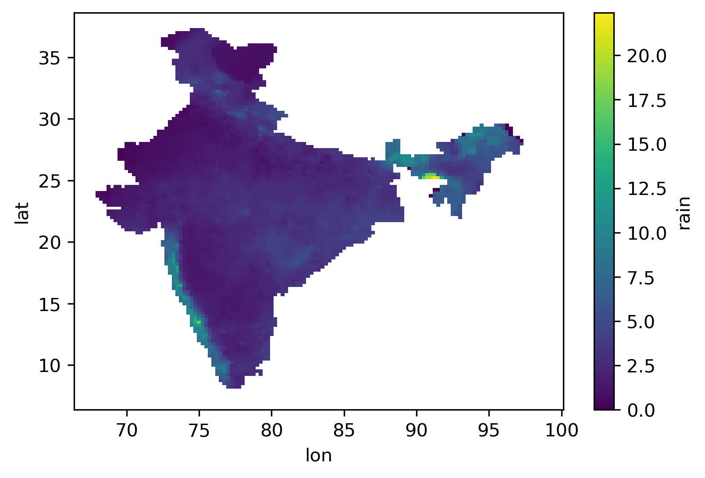

Getting data
============

load()
------

``imdlib.load()`` downloads IMD gridded data, keeps the files in a local cache and returns an
``IMD class object``. Loading the same period again does not need a new download, as it uses
the earlier downloads.

.. code-block:: python

    import imdlib as imd

    data = imd.load('rain', 2010, 2018)  # other options are ('tmin'/ 'tmax')

    # Part of a year, given as 'YYYY-MM-DD'
    tmax = imd.load('tmax', '2023-04-01', '2023-06-30')

Only files that are not in the cache are downloaded, one at a time. For each file, a line
first shows ``waiting for IMD server`` with the elapsed time, then a progress bar:

.. code-block:: text

    Downloading 1 file from IMD into /home/user/.cache/imdlib
    tmax 2023  ████████████████████████  1.4 / 1.4 MB  38s

Use ``progress=False`` to turn the output off.

- Each file is checked for its complete size before it is stored, so the cache never holds an
  incomplete download. Failed connections are retried automatically. If a download still fails,
  an error is raised. Files downloaded before the error stay in the cache, so running the same
  call again continues where it stopped.

- The archive contains complete years only. It starts in 1901 for rainfall and in 1951 for
  temperature. If a requested year is not published yet, an error is raised that suggests an
  earlier end year. More recent days are available as `Real-time data`_.

- ``offline=True`` never uses the network. If files are missing from the cache, it raises an
  error that lists them.

- The loaded data is held in memory. For long periods, especially of rainfall, a warning shows
  the estimated memory needed. If loading fails or is slow, load a shorter period.

Real-time data
--------------

IMD also publishes provisional daily real-time data for recent days. Rainfall is on the same
0.25\ :sup:`o`\  grid as the archive; temperature is on a 0.5\ :sup:`o`\  grid (archive: 1.0\ :sup:`o`\ ). ``'rain_gpm'`` gives GPM-based rainfall on a 0.25\ :sup:`o`\  grid
covering 30\ :sup:`o`\ S-40\ :sup:`o`\ N, 50\ :sup:`o`\ E-110\ :sup:`o`\ E, including the ocean.

.. code-block:: python

    import imdlib as imd

    data = imd.load('rain', '2026-10-01', '2026-10-05', source='realtime')
    gpm = imd.load('rain_gpm', '2026-10-01', '2026-10-05', source='realtime')

The most recent days may not be published yet; requesting them raises an error that lists the
missing days and suggests an earlier end date.

Cache
-----

The cache is in the user cache directory of your system:

- Linux: ``~/.cache/imdlib`` (or ``$XDG_CACHE_HOME/imdlib``)
- Windows: ``C:\Users\<name>\AppData\Local\imdlib\Cache``
- macOS: ``~/Library/Caches/imdlib``

To use another location, pass ``cache_dir=`` to ``load()``, call ``cache.set_dir()``
once per session, or set the ``IMDLIB_CACHE`` environment variable (in this order of precedence).

.. code-block:: python

    import imdlib as imd

    imd.cache.info()                # location, cached periods, size, download dates
    imd.cache.clear('rain', 2018)   # remove cached files (prints the space freed)
    imd.cache.set_dir('D:/imd_cache')
    imd.cache.unlock()              # if load() waits for a download that is no longer running

``manifest.json`` in the cache directory records the source and checksum (SHA-256) of each
file, so two copies can be compared. IMD sometimes republishes a year with corrections. To get
the new version, clear that year and load it again:

.. code-block:: python

    imd.cache.clear('rain', 2018)
    data = imd.load('rain', 2018)

get_data() and open_data()
--------------------------

For most uses, ``load()`` is simpler: it downloads and reads in one call. ``get_data()``
downloads files under IMD's file names (or as ``<year>.grd``) and reads them; ``open_data()``
reads such files without downloading, for example files you already have.
``get_real_data()`` and ``open_real_data()`` do the same for real-time data.

.. code-block:: python

    import imdlib as imd

    file_dir = 'data'
    data = imd.get_data('rain', 2010, 2018, fn_format='yearwise', file_dir=file_dir)
    data = imd.open_data('rain', 2010, 2018, 'yearwise', file_dir)

    data = imd.get_real_data('rain', '2025-07-01', '2025-07-10', file_dir)
    data = imd.open_real_data('rain', '2025-07-01', '2025-07-10', file_dir)

- With ``fn_format='yearwise'`` files are saved as ``<file_dir>/rain/2010.grd``; without it,
  IMD's file names are kept (e.g. ``Rainfall_ind2010_rfp25.grd``).

- If ``file_dir`` is not given, the current working directory is used.

- ``open_data()`` looks in the ``rain``, ``tmin`` or ``tmax`` sub-folder of ``file_dir`` if it
  exists, otherwise in ``file_dir`` itself. With ``fn_format='yearwise'`` the file names do not
  include the variable, so keep each variable in its own sub-folder.

- Files already in the folder are skipped. If a year is not published yet, an error is raised
  and nothing is saved for that year.

Processing
==========

Getting the xarray object for further processing:

.. code-block:: python

    ds = data.get_xarray()
    print(ds)

.. code-block:: python

    <xarray.Dataset>
    Dimensions:  (lat: 129, lon: 135, time: 3287)
    Coordinates:
    * lat      (lat) float64 6.5 6.75 7.0 7.25 7.5 ... 37.5 37.75 38.0 38.25 38.5
    * lon      (lon) float64 66.5 66.75 67.0 67.25 67.5 ... 99.25 99.5 99.75 100.0
    * time     (time) datetime64[ns] 2010-01-01 2010-01-02 ... 2018-12-31
    Data variables:
        rain     (time, lat, lon) float64 -999.0 -999.0 -999.0 ... -999.0 -999.0
    Attributes:
        Conventions:  CF-1.7
        title:        IMD gridded data
        source:       https://imdpune.gov.in/
        history:      2021-02-27 08:10:43.519783 Python
        references:   
        comment:      
        crs:          epsg:4326

Climatology & Anomaly
=====================

Compute monthly climatology (long-term mean) and anomaly (departure from mean).
For rainfall, monthly values are totals (mm). For temperature, monthly values are means (C).
Requires at least one full year of daily data.

.. code-block:: python

    import imdlib as imd

    # Monthly climatology — shape: (12, lon, lat)
    data = imd.load('rain', 1991, 2020)
    clim = data.climatology()

    # Monthly anomaly against own mean — shape: (N_months, lon, lat)
    data = imd.load('rain', 1991, 2020)
    anom = data.anomaly()

    # Anomaly against a reference period (e.g., 1991-2020 baseline)
    ref = imd.load('rain', 1991, 2020)
    ref_clim = ref.climatology()

    recent = imd.load('rain', 2020, 2020)
    anom = recent.anomaly(ref_clim)

Plotting
========

Plotting can be done by:

.. code-block:: python

    ds = ds.where(ds['rain'] != -999.) #Remove NaN values
    ds['rain'].mean('time').plot()
    

   
Saving
======

Get data for a given location, convert, and save into csv file:

.. code-block:: python

    lat = 20.03
    lon = 77.23
    out_dir = 'output'  # existing folder (optional; default: current directory)
    data.to_csv('test.csv', lat, lon, out_dir)

Save data in netCDF format:

.. code-block:: python

    data.to_netcdf('test.nc', out_dir)

Save data in GeoTIFF format (if you have rioxarray library):

.. code-block:: python

    data.to_geotiff('test.tif', out_dir)

Climate Indices
===============

Available climate indices are listed in a Table at the reference section of this  documentation. 

An example of computing heavy precipitation days between year 2015 and 2019 is as follows:

.. code-block:: python

    import imdlib as imd
    start_yr, end_yr = 2015, 2019
    variable = 'rain'
    rain = imd.load(variable, start_yr, end_yr)
    d64 =  rain.compute('d64', 'A', threshold=64.5)

An example of computing consecutive dry days (longest dry spell) between year 2015 and 2019:

.. code-block:: python

    import imdlib as imd
    start_yr, end_yr = 2015, 2019
    variable = 'rain'
    rain = imd.load(variable, start_yr, end_yr)

    # Using ETCCDI standard threshold (1.0 mm)
    cdd = rain.compute('cdd', 'A')

    # Using IMD rainy-day threshold (2.5 mm)
    cdd = rain.compute('cdd', 'A', threshold=2.5)

Heat Wave & Cold Wave
=====================

Detect heat waves and cold waves using IMD's official two-gate classification
with terrain-specific thresholds (plains, hilly, coastal).

- Heat wave detection requires ``tmax`` data.
- Cold wave detection requires ``tmin`` data.
- A bundled region mask classifies each grid cell as plains, hilly, or coastal.

**Output modes:**

- ``output='daily'`` — Returns a per-day classification for each grid cell:
  ``0`` = no event, ``1`` = heat/cold wave, ``2`` = severe heat/cold wave.
  Shape: same as input ``(no_days, lon, lat)``.

- ``output='annual'`` — Returns annual count of event days per grid cell.
  Shape: ``(no_years, lon, lat)``. Use ``count`` to select which events to count:

  - ``count='total'`` — all event days (heat/cold wave + severe). **(default)**
  - ``count='hw'`` or ``count='cw'`` — only non-severe event days.
  - ``count='severe'`` — only severe event days.

**Normal period (climatological reference):**

- If loaded data spans **>= 30 years**, normals are computed automatically from the full data range.
- If loaded data spans **< 30 years**, you must provide ``norm_start`` and ``norm_end`` (minimum 10 years).
- The normal period can extend **outside** the loaded data range. imdlib then reads the whole normal
  period with ``load()``: years already in the cache are reused and missing years are downloaded into
  the cache, not the working directory.

Daily classification
--------------------

.. code-block:: python

    import imdlib as imd

    # Each cell on each day is classified as 0 (no event), 1 (HW), or 2 (severe HW)
    data = imd.load('tmax', 1991, 2020)
    hw = data.heatwave(output='daily')
    # hw.data.shape: (10958, 31, 31) — same as input

Annual counts
-------------

.. code-block:: python

    import imdlib as imd

    # Total heat wave days per year (HW + severe)
    data = imd.load('tmax', 1991, 2020)
    hw = data.heatwave(output='annual', count='total')
    # hw.data.shape: (30, 31, 31) — one value per year

    # Only severe heat wave days per year
    data = imd.load('tmax', 1991, 2020)
    hw = data.heatwave(output='annual', count='severe')

    # Only non-severe heat wave days per year
    data = imd.load('tmax', 1991, 2020)
    hw = data.heatwave(output='annual', count='hw')

Cold wave detection
-------------------

.. code-block:: python

    import imdlib as imd

    # Same interface as heatwave, but uses tmin
    data = imd.load('tmin', 1991, 2020)
    cw = data.coldwave(output='annual', count='total')

Custom normal period
--------------------

.. code-block:: python

    import imdlib as imd

    # For short data ranges, provide the normal period explicitly
    data = imd.load('tmax', 2011, 2020)
    hw = data.heatwave(output='annual', norm_start=2011, norm_end=2020)

    # Normal period can be outside loaded data (read from the cache, downloaded if needed)
    data = imd.load('tmax', 2018, 2020)
    hw = data.heatwave(output='annual', norm_start=1991, norm_end=2020)

SPI & SPEI
==========

Compute Standardized Precipitation Index (SPI) and Standardized Precipitation
Evapotranspiration Index (SPEI) for drought monitoring.

- **SPI** uses rainfall only. Gamma distribution with MLE (McKee 1993, WMO standard).
- **SPEI** uses rainfall + temperature. Generalized logistic distribution with L-moments
  (Vicente-Serrano 2010). PET computed via Hargreaves-Samani from tmax/tmin.
- ``timescale``: accumulation window in months (1, 3, 6, 12, 24, etc.)
- Output: monthly values, approximately standard normal N(0,1).
- Requires at least 10 years of data.

**Drought classification:**

- SPI/SPEI <= -2.0: Extremely dry
- SPI/SPEI -1.5 to -2.0: Severely dry
- SPI/SPEI -1.0 to -1.5: Moderately dry
- SPI/SPEI -1.0 to +1.0: Near normal
- SPI/SPEI >= +2.0: Extremely wet

SPI
---

.. code-block:: python

    import imdlib as imd

    # SPI-3 (3-month accumulation)
    data = imd.load('rain', 1991, 2020)
    spi3 = data.compute('spi', 'M', timescale=3)
    # spi3.data.shape: (360, 135, 129) — monthly SPI values

    # SPI-12 (hydrological drought)
    data = imd.load('rain', 1991, 2020)
    spi12 = data.compute('spi', 'M', timescale=12)

SPEI
----

.. code-block:: python

    import imdlib as imd

    # SPEI-3 requires rainfall, tmax, and tmin
    rain = imd.load('rain', 1991, 2020)
    tmax = imd.load('tmax', 1991, 2020)
    tmin = imd.load('tmin', 1991, 2020)
    spei3 = rain.compute('spei', 'M', timescale=3, tmax=tmax, tmin=tmin)

Spatial Mean
============

Compute area-weighted spatial mean to get a single time series from gridded data.
Uses cosine-latitude weighting to correct for meridian convergence
(grid cells at higher latitudes are narrower). Respects ``land_mask`` —
ocean and boundary cells are excluded automatically.

Returns a ``pandas.DataFrame`` with a ``DatetimeIndex``.

.. code-block:: python

    import imdlib as imd

    # Basin-averaged daily rainfall
    data = imd.load('rain', 2010, 2020)
    data.clip('godavari_basin.shp')
    ts = data.spatial_mean()
    # ts is a pandas DataFrame, shape (4018, 1), column 'rain'

Works on any computed output:

.. code-block:: python

    import imdlib as imd

    # District-averaged SPI-3
    data = imd.load('rain', 1991, 2020)
    data.clip('nashik_district.shp')
    ts = data.compute('spi', 'M', timescale=3).spatial_mean()

    # All-India climatological monthly mean
    data = imd.load('rain', 1991, 2020)
    ts = data.climatology().spatial_mean()

    # Unweighted mean (for small catchments where distortion is negligible)
    ts = data.spatial_mean(weighted=False)
