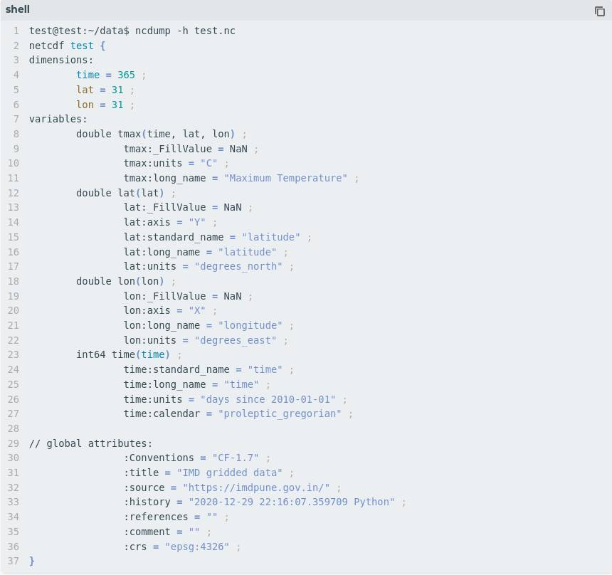

.. _cf-conventions:

CF conventions
==========================

NetCDF File Convention
-----------------------

The IMDLIB focuses on producing netCDF (network Common Data Form) based final output as 
netCDF is the format most commonly used for climate model generated data. The netCDF Climate 
and Forecast (CF) Metadata Conventions, Version 1.7, has been adopted by IMDLIB for its 
efficient and consistent use with other standard netCDF based tool/applications. The 
epsg:4326 coordinate reference systems (CRS) is considered in CF naming convention and is 
vital for the function to_geotiff to work correctly. For more information on the CF convention, 
users are requested to visit CF Conventions Home Page and xarray & CF integration resources.

