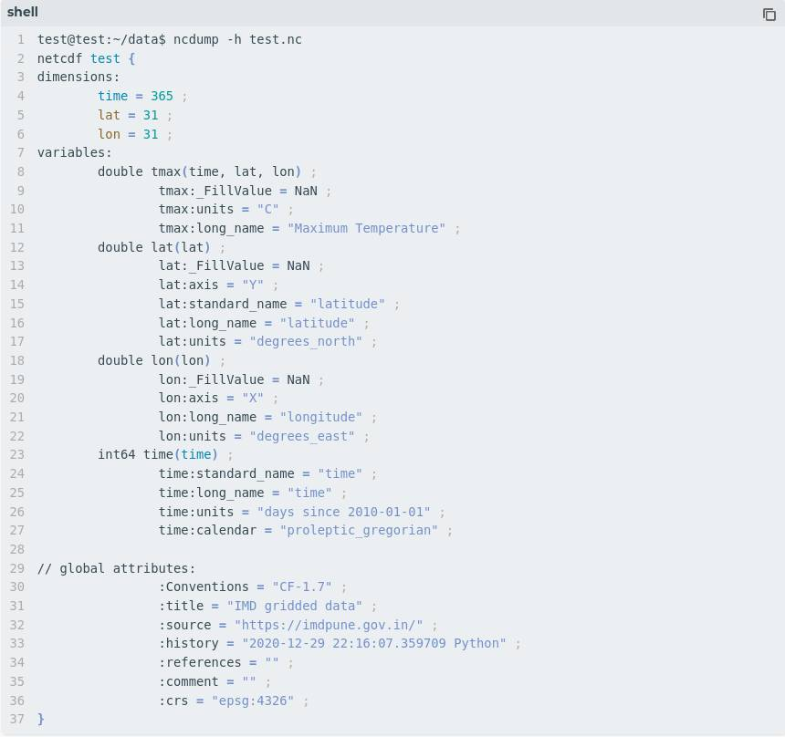

.. _cf-conventions:

CF conventions
==========================

NetCDF File Convention
-----------------------

The IMDLIB produces netCDF (network Common Data Form) based final output. It is the most common data format in hydroclimatic studies. The netCDF Climate and Forecast (CF) Metadata Conventions, Version 1.7, has been adopted by IMDLIB for the efficient and consistent use with other standard netCDF  tools/applications. The EPSG:4326 coordinate reference systems (CRS) are considered in the CF naming convention. They are vital for the function to_geotiff to work correctly. Users may visit the `CF Conventions homepage`_ for more information.

.. _CF Conventions homepage: https://cfconventions.org/

Data cut with ``clip()`` has one more coordinate, ``cell_fraction`` (lat, lon): the fraction of each grid cell inside the region (``units`` 1; 0 outside). Cells that are partly inside keep their values, and ``spatial_mean()`` weights them by this fraction.

